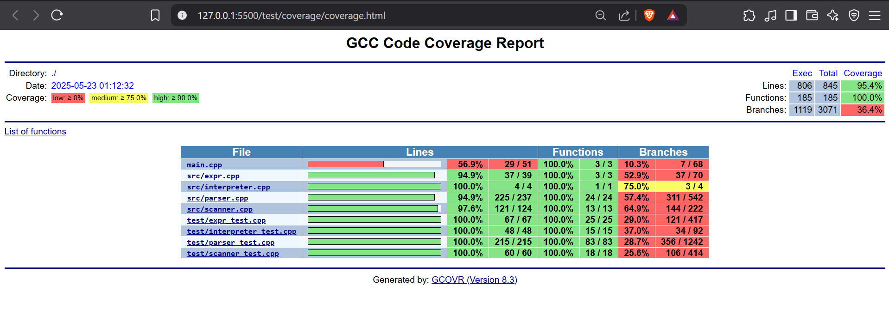

# Release v0.1.4

A Windows .exe is available in the [v0.1.4 release](https://github.com/abhiraj-kale/Interpreter/releases/tag/v0.1.4).

Download:
➡️ [Interpreter.exe](https://github.com/abhiraj-kale/Interpreter/releases/download/v0.1.4/Interpreter.exe)

# Interpreter Built Using C++ for a Custom Language

 A lightweight C++ interpreter that parses and evaluates arithmetic and comparison expressions with support for variables, string literals, functions, and basic statements. It provides a simple REPL (Read-Eval-Print Loop) interface for interactive execution.

## Architecture Overview

This interpreter is structured in the following phases:

- **Scanner (Lexer)** – Converts input strings into a list of tokens.
- **Parser** – Builds an Abstract Syntax Tree (AST) from the tokens.
- **Interpreter** – Walks the AST and evaluates expressions.
- **REPL** – A loop that reads user input, parses, evaluates, and prints results.

Each component is modular and easy to extend with features like user-defined functions, control flow, and more.

---

## Features

- **Arithmetic operators**: `+`, `-`, `*`, `/`
- **Comparison operators**: `==`, `!=`, `<`, `<=`, `>`, `>=`
- **String literals**: `"hello"`
- **Variable assignment and usage**:
  - `let x = 10;`
  - `var y = x + 5;`
- **Print statements**:
  - `print x + y;`
- **Function definitions and calls**:
  - `function add(x, y) { return x + y; }`
  - `let z = add(2, 3);`
  - `print z;`
- **Control flow support:**
  - `while` loops
  - `for` loops
- **Semicolon-terminated statements**
- **REPL interface** for interactive command input
- **Error handling** for:
  - Syntax errors
  - Undefined variables
  - Division by zero
  - Unterminated strings
  - Type errors
---

## How to Use (via REPL)

When you run the interpreter executable, you'll see a `>` prompt.

### Examples:

```txt
> let x = 10;
> var y = x * 2;
> print x + y;
30
> print "hello " + "world";
hello world
> function add(a, b) { return a + b; }
> print add(5, 7);
12
> for (let i = 0; i < 5; i = i + 1) {
    print i;
  }
0
1
2
3
4
> let n = 3;
> while (n > 0) {
    print n;
    n = n - 1;
  }
3
2
1
```
## Installation

### Prerequisites

- C++17 compatible compiler (GCC, Clang, MSVC)
- CMake version 3.16 or later

### Build Instructions

```bash
git clone https://github.com/your-username/interpreter.git
cd interpreter

# Create a build directory
mkdir -p out/build && cd out/build

# Configure the project
cmake --preset default

# Build the executable and tests
cmake --build . --target Interpreter
cmake --build . --target run_tests
```
## How to Run Tests
Tests are written using Google Test and cover all major components of the interpreter.

To build and run the test suite:
```
cd out/build/CMakePresets
InterpreterTests.exe
```

## How to Generate Code Coverage Reports
After running tests or executing the interpreter, generate coverage reports with:

```
mkdir -p coverage
gcovr -r . --html --html-details -o coverage/coverage.html --exclude '.*main\.cpp'
```

Open coverage/coverage.html in your browser to view detailed coverage reports. 

`
The file main.cpp is excluded from the coverage report because it primarily contains the REPL loop and program entry point, which are not easily unit tested. Most core logic is covered in modular components (scanner, parser, interpreter) which have full test coverage.
`

